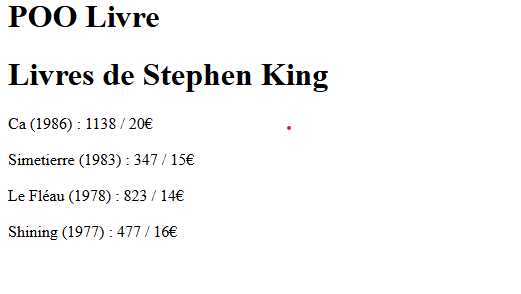

# **README OOP BOOK**
 
## **OOP BOOK**
## **Introduction**
 
This exercise is here to learn the basic of OOP or Object Oriented Programming in PHP
## **Main function of the project**

This function shows each book's name and info.
 

``` public function  afficherBibliographie()  {
        $result = "<h1>Livres de $this</h1>";

        foreach($this->livres as $livre){

           $result.= $livre."<br>";
        }

        return $result;
        
       


    }
    
 
```
 

 
## **if you have question about the project you can contact me on my [linkedIn]()**